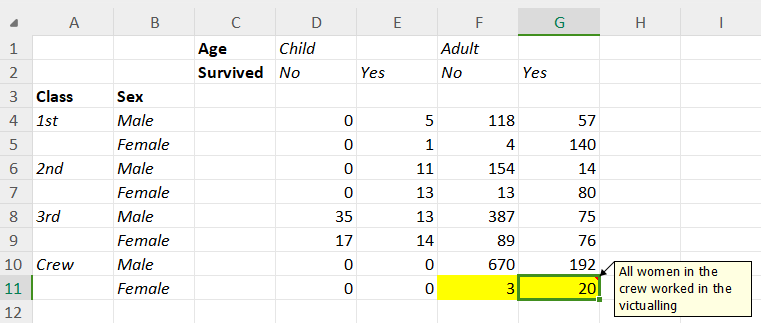
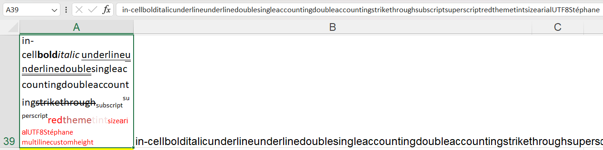

# Importing ANY Excel

- [The problem](#the-problem)
- [Using a different approach](#using-a-different-approach)
- [Importing data](#importing-data)
  - [Titanic spreadsheet](#titanic-spreadsheet)
  - [Example spreadsheet](#example-spreadsheet)
- [Exploring results](#exploring-results)
  - [Describing cells’ possition](#describing-cells-possition)
  - [Describing cells’ content](#describing-cells-content)
  - [Describing cells’ formulas](#describing-cells-formulas)
  - [Describing cells’ format](#describing-cells-format)

## The problem

Import spreadsheet files into `R` must of the time is really easy using
packages like `readxl`, `openxlsx` or `openxlsx2` if that data follows a
tabular form, but what happens when the data doesn’t follow that rule?

You could need to edit the file to make to make explicit some formats or
reshape the data. That’s a possibility if you have few columns and rows,
but for files with hundreds of columns and rows that might not be
possible.

## Using a different approach

Rather than training to import a table from the spreadsheets `tidyxl`
creates a `tibble` where every cell is represented by a row and the
columns represent different properties linked to each cell and once we
have the data in `R` we can use `unpivotr`to tidy the result and start
out analysis.

So let’s load the libraries to use

``` r
library(tidyxl)
library(data.table)
library(unpivotr)
```

## Importing data

### Titanic spreadsheet

This data is a simple example of summary tables we can find in papers,
very simple to understand by humands but very hard to import to `R`.



``` r
TitanicPath <- system.file(
  "extdata/titanic.xlsx",
  package = "tidyxl"
)

TitanicCells <- xlsx_cells(TitanicPath)
TitanicFormats <- xlsx_formats(TitanicPath)

setDT(TitanicCells)

pillar::glimpse(TitanicCells)
```

    Rows: 60
    Columns: 24
    $ sheet               <chr> "Sheet1", "Sheet1", "Sheet1", "Sheet1", "Sheet1", …
    $ address             <chr> "C1", "D1", "E1", "F1", "G1", "C2", "D2", "E2", "F…
    $ row                 <int> 1, 1, 1, 1, 1, 2, 2, 2, 2, 2, 3, 3, 4, 4, 4, 4, 4,…
    $ col                 <int> 3, 4, 5, 6, 7, 3, 4, 5, 6, 7, 1, 2, 1, 2, 4, 5, 6,…
    $ is_blank            <lgl> FALSE, FALSE, TRUE, FALSE, TRUE, FALSE, FALSE, FAL…
    $ content             <chr> "0", "1", NA, "2", NA, "3", "4", "5", "4", "5", "6…
    $ data_type           <chr> "character", "character", "blank", "character", "b…
    $ error               <chr> NA, NA, NA, NA, NA, NA, NA, NA, NA, NA, NA, NA, NA…
    $ logical             <lgl> NA, NA, NA, NA, NA, NA, NA, NA, NA, NA, NA, NA, NA…
    $ numeric             <dbl> NA, NA, NA, NA, NA, NA, NA, NA, NA, NA, NA, NA, NA…
    $ date                <dttm> NA, NA, NA, NA, NA, NA, NA, NA, NA, NA, NA, NA, N…
    $ character           <chr> "Age", "Child", NA, "Adult", NA, "Survived", "No",…
    $ character_formatted <list> [<tbl_df[1 x 14]>], [<tbl_df[1 x 14]>], <NULL>, […
    $ formula             <chr> NA, NA, NA, NA, NA, NA, NA, NA, NA, NA, NA, NA, NA…
    $ is_array            <lgl> FALSE, FALSE, FALSE, FALSE, FALSE, FALSE, FALSE, F…
    $ formula_ref         <chr> NA, NA, NA, NA, NA, NA, NA, NA, NA, NA, NA, NA, NA…
    $ formula_group       <int> NA, NA, NA, NA, NA, NA, NA, NA, NA, NA, NA, NA, NA…
    $ comment             <chr> NA, NA, NA, NA, NA, NA, NA, NA, NA, NA, NA, NA, NA…
    $ height              <dbl> 15, 15, 15, 15, 15, 15, 15, 15, 15, 15, 15, 15, 15…
    $ width               <dbl> 8.38, 8.38, 8.38, 8.38, 8.38, 8.38, 8.38, 8.38, 8.…
    $ row_outline_level   <dbl> 1, 1, 1, 1, 1, 1, 1, 1, 1, 1, 1, 1, 1, 1, 1, 1, 1,…
    $ col_outline_level   <dbl> 1, 1, 1, 1, 1, 1, 1, 1, 1, 1, 1, 1, 1, 1, 1, 1, 1,…
    $ style_format        <chr> "Normal", "Normal", "Normal", "Normal", "Normal", …
    $ local_format_id     <int> 2, 3, 3, 3, 3, 2, 3, 3, 3, 3, 2, 2, 3, 3, 1, 1, 1,…

### Example spreadsheet


``` r
ExamplePath <- system.file(
  "extdata/examples.xlsx", 
  package = "tidyxl"
)

ExampleCells <- xlsx_cells(ExamplePath, sheets = "Sheet1")
ExampleFormats <- xlsx_formats(ExamplePath)

setDT(ExampleCells)
setkey(ExampleCells, address)

pillar::glimpse(ExampleCells)
```

    Rows: 395
    Columns: 24
    $ sheet               <chr> "Sheet1", "Sheet1", "Sheet1", "Sheet1", "Sheet1", …
    $ address             <chr> "A1", "A10", "A100", "A101", "A102", "A103", "A104…
    $ row                 <int> 1, 10, 100, 101, 102, 103, 104, 105, 106, 107, 108…
    $ col                 <int> 1, 1, 1, 1, 1, 1, 1, 1, 1, 1, 1, 1, 1, 1, 1, 1, 1,…
    $ is_blank            <lgl> FALSE, FALSE, FALSE, FALSE, FALSE, FALSE, FALSE, F…
    $ content             <chr> "#DIV/0!", "107", "0", "0", "0", "0", "0", "0", "0…
    $ data_type           <chr> "error", "character", "numeric", "numeric", "numer…
    $ error               <chr> "#DIV/0!", NA, NA, NA, NA, NA, NA, NA, NA, NA, NA,…
    $ logical             <lgl> NA, NA, NA, NA, NA, NA, NA, NA, NA, NA, NA, NA, NA…
    $ numeric             <dbl> NA, NA, 0.0, 0.0, 0.0, 0.0, 0.0, 0.0, 0.0, 0.1, NA…
    $ date                <dttm> NA, NA, NA, NA, NA, NA, NA, NA, NA, NA, NA, NA, N…
    $ character           <chr> NA, "comment", NA, NA, NA, NA, NA, NA, NA, NA, "Da…
    $ character_formatted <list> <NULL>, [<tbl_df[1 x 14]>], <NULL>, <NULL>, <NULL…
    $ formula             <chr> "1/0", NA, "LOG10", "LOG11", "LOG12", "LOG10(1)", …
    $ is_array            <lgl> FALSE, FALSE, FALSE, FALSE, FALSE, FALSE, FALSE, F…
    $ formula_ref         <chr> NA, NA, NA, "A101:A102", NA, NA, "A104:A105", NA, …
    $ formula_group       <int> NA, NA, NA, 3, 3, NA, 4, 4, NA, NA, NA, NA, NA, NA…
    $ comment             <chr> NA, "commentwithtextformatting", NA, NA, NA, NA, N…
    $ height              <dbl> 14.25, 14.25, 14.25, 14.25, 14.25, 14.25, 14.25, 1…
    $ width               <dbl> 19.375, 19.375, 19.375, 19.375, 19.375, 19.375, 19…
    $ row_outline_level   <dbl> 1, 1, 1, 1, 1, 1, 1, 1, 1, 1, 1, 1, 1, 1, 1, 1, 1,…
    $ col_outline_level   <dbl> 1, 1, 1, 1, 1, 1, 1, 1, 1, 1, 1, 1, 1, 1, 1, 1, 1,…
    $ style_format        <chr> "Normal", "Normal", "Normal", "Normal", "Normal", …
    $ local_format_id     <int> 1, 4, 1, 1, 1, 1, 1, 1, 1, 1, 1, 1, 17, 74, 76, 1,…

## Exploring results

To understand to use this approch we need to undertand the results of
`xlsx_cells` column by column and it relates with the `xlsx_formats`
results.

### Describing cells’ possition

- **sheet**: The worksheet that the cell is from.

``` r
ExampleCells[, .N, by = "sheet"]
```

        sheet   N
    1: Sheet1 395

- **address**: The cell address in A1 notation.
- **row**: The row number of a cell address (integer).
- **col**: The column number of a cell address (integer).

``` r
ExampleCells[1:6, .(sheet,address, row, col)]
```

        sheet address row col
    1: Sheet1      A1   1   1
    2: Sheet1     A10  10   1
    3: Sheet1    A100 100   1
    4: Sheet1    A101 101   1
    5: Sheet1    A102 102   1
    6: Sheet1    A103 103   1

### Describing cells’ content

- **data_type**: The type of a cell, referring to the following columns:
  error, logical, numeric, date, character, blank.
- **is_blank**: It’s `TRUE` if the cell has a value.
- **content**: Raw cell value before type conversion. I may be:
  - A numeric value
  - A data/datetime in one of the Excel’s date/datetime systems.
  - An index into an internal table of strings.

``` r
ExampleCells[, .SD[1:2],
             by = "data_type",
             .SDcols = c("is_blank", "content")]
```

        data_type is_blank             content
     1:     error    FALSE             #DIV/0!
     2:     error    FALSE              #NAME?
     3: character    FALSE                 107
     4: character    FALSE                 137
     5:   numeric    FALSE                   0
     6:   numeric    FALSE                   0
     7:      date    FALSE               42736
     8:      date    FALSE 0.35416666666666669
     9:     blank     TRUE                <NA>
    10:     blank     TRUE                <NA>
    11:   logical    FALSE                   1
    12:   logical    FALSE                   1

- **error**: The error value of a cell.
- **logical**: The boolean value of a cell.
- **numeric**: The numeric value of a cell.
- **date**: The date value of a cell.
- **character**: The string value of a cell.
- **comment**: The text of a comment attached to a cell.

``` r
ValueCols <- c(
  "error",
  "character",
  "logical",
  "numeric",
  "date",
  "comment"
)

ExampleCells[is_blank == FALSE, 
             .SD[order(is.na(comment))][1:2],
             by = "data_type",
             .SDcols = ValueCols]
```

        data_type   error                                               character
     1:     error #DIV/0!                                                    <NA>
     2:     error  #NAME?                                                    <NA>
     3: character    <NA>                                                 comment
     4: character    <NA> Data validation, list, in-cell dropdown, warning symbol
     5:   numeric    <NA>                                                    <NA>
     6:   numeric    <NA>                                                    <NA>
     7:      date    <NA>                                                    <NA>
     8:      date    <NA>                                                    <NA>
     9:   logical    <NA>                                                    <NA>
    10:   logical    <NA>                                                    <NA>
        logical numeric                date                   comment
     1:      NA      NA                <NA>                      <NA>
     2:      NA      NA                <NA>                      <NA>
     3:      NA      NA                <NA> commentwithtextformatting
     4:      NA      NA                <NA>                      <NA>
     5:      NA       0                <NA>                      <NA>
     6:      NA       0                <NA>                      <NA>
     7:      NA      NA 2017-01-01 00:00:00                      <NA>
     8:      NA      NA 1899-12-31 08:30:00                      <NA>
     9:    TRUE      NA                <NA>                      <NA>
    10:    TRUE      NA                <NA>                      <NA>

### Describing cells’ formulas

- **formula**: Shows as a text the formula used to return any value
  after removing brakes `{}` for array functions.
- **formula_group**: When 2 cells has the same function or just changing
  by cell reference then Excel only the writes the formula once in the
  document and `tidyxl`infers the group for those cases.
- **formula_ref**: The address of a range of cells group to which an
  **array** formula or **shared** formula applies.

``` r
ExampleCells[.(address = c(paste0("A",19:21),
                           paste0("B",19:21))),
             .(address,
               formula,
               formula_group,
               formula_ref)]
```

       address formula formula_group formula_ref
    1:     A19 $A$18+1            NA        <NA>
    2:     A20 $A$18+1             0     A20:A21
    3:     A21 $A$18+1             0        <NA>
    4:     B19   A18+2            NA        <NA>
    5:     B20   A19+2             1     B20:B21
    6:     B21   A20+2             1        <NA>

- **is_array**: Whether or not the formula is an array formula. In
  `A22`the result is presented in the same cell, but for `A23` the
  result is displayed in cells `A23:A24`.

``` r
ExampleCells[address %chin% paste0("A",22:24) &
               sheet == "Sheet1",
             .(address,
               formula,
               is_array,
               formula_ref)]
```

       address              formula is_array formula_ref
    1:     A22 SUM(A19:A21*B19:B21)     TRUE         A22
    2:     A23      A19:A20*B19:B20     TRUE     A23:A24
    3:     A24                 <NA>    FALSE        <NA>

### Describing cells’ format

- **character_formatted**: As a single cell can contain *substrings with
  different formatting*, each `character` cell has a `tibble` with one
  row per row.

  - If a cell has many words but one format for all of them, this column
    will return a `tibble` with single row.

``` r
ExampleStringCellFormat <-
  ExampleCells[data_type == "character" &
                 character %like% " ", 
               .(address,
                 character,
                 character_formatted)
  ][1:6]

ExampleStringCellFormat
```

       address                                               character
    1:    A108 Data validation, list, in-cell dropdown, warning symbol
    2:    A109 Data validation, list, in-cell dropdown, warning symbol
    3:    A112                                               some text
    4:    A132                 in-cell format with cell-level defaults
    5:    A133                             underline single accounting
    6:    A134                             underline double accounting
       character_formatted
    1:      <tbl_df[1x14]>
    2:      <tbl_df[1x14]>
    3:      <tbl_df[1x14]>
    4:      <tbl_df[3x14]>
    5:      <tbl_df[1x14]>
    6:      <tbl_df[1x14]>

- And unnesting the column you will see just `NAs` on each column.

``` r
ExampleStringCellFormat[, character_formatted[[1L]],
                        by = "address"]
```

       address                                               character  bold italic
    1:    A108 Data validation, list, in-cell dropdown, warning symbol    NA     NA
    2:    A109 Data validation, list, in-cell dropdown, warning symbol    NA     NA
    3:    A112                                               some text    NA     NA
    4:    A132                                                in-cell  FALSE   TRUE
    5:    A132                                                  format  TRUE  FALSE
    6:    A132                                with cell-level defaults FALSE   TRUE
    7:    A133                             underline single accounting    NA     NA
    8:    A134                             underline double accounting    NA     NA
       underline strike vertAlign size color_rgb color_theme color_indexed
    1:      <NA>     NA      <NA>   NA      <NA>          NA            NA
    2:      <NA>     NA      <NA>   NA      <NA>          NA            NA
    3:      <NA>     NA      <NA>   NA      <NA>          NA            NA
    4:      <NA>  FALSE      <NA>    0  FF0000FF          NA            NA
    5:      <NA>  FALSE      <NA>    0  FF0000FF          NA            NA
    6:      <NA>  FALSE      <NA>    0  FFFF0000          NA            NA
    7:      <NA>     NA      <NA>   NA      <NA>          NA            NA
    8:      <NA>     NA      <NA>   NA      <NA>          NA            NA
       color_tint  font family scheme
    1:         NA  <NA>     NA   <NA>
    2:         NA  <NA>     NA   <NA>
    3:         NA  <NA>     NA   <NA>
    4:         NA Arial      2   <NA>
    5:         NA Arial      2   <NA>
    6:         NA Arial      2   <NA>
    7:         NA  <NA>     NA   <NA>
    8:         NA  <NA>     NA   <NA>

- But exploring the cell `A4` we can see how the `tibble` breaks the
  cell in 16 rows representing different substring’s formats.



``` r
ExampleCells[address == "A39", 
             character_formatted[[1L]]] |>
  as.data.table()
```

                                  character  bold italic        underline strike
     1:                             in-cell FALSE  FALSE             <NA>  FALSE
     2:                                bold  TRUE  FALSE             <NA>  FALSE
     3:                              italic FALSE   TRUE             <NA>  FALSE
     4:                           underline FALSE  FALSE           single  FALSE
     5:                     underlinedouble FALSE  FALSE           double  FALSE
     6:                    singleaccounting FALSE  FALSE singleAccounting  FALSE
     7:                    doubleaccounting FALSE  FALSE doubleAccounting  FALSE
     8:                       strikethrough FALSE  FALSE             <NA>   TRUE
     9:                           subscript FALSE  FALSE             <NA>  FALSE
    10:                         superscript FALSE  FALSE             <NA>  FALSE
    11:                                 red FALSE  FALSE             <NA>  FALSE
    12:                               theme FALSE  FALSE             <NA>  FALSE
    13:                                tint FALSE  FALSE             <NA>  FALSE
    14:                                size FALSE  FALSE             <NA>  FALSE
    15:                               arial FALSE  FALSE             <NA>  FALSE
    16: UTF8Stéphane\nmultilinecustomheight FALSE  FALSE             <NA>  FALSE
          vertAlign size color_rgb color_theme color_indexed color_tint    font
     1:        <NA>    0      <NA>          NA            NA         NA Calibri
     2:        <NA>    0  FF000000           2            NA         NA Calibri
     3:        <NA>    0  FF000000           2            NA         NA Calibri
     4:        <NA>    0  FF000000           2            NA         NA Calibri
     5:        <NA>    0  FF000000           2            NA         NA Calibri
     6:        <NA>    0  FF000000           2            NA         NA Calibri
     7:        <NA>    0  FF000000           2            NA         NA Calibri
     8:        <NA>    0  FF000000           2            NA         NA Calibri
     9:   subscript    0  FF000000           2            NA         NA Calibri
    10: superscript    0  FF000000           2            NA         NA Calibri
    11:        <NA>    0  FFFF0000          NA            NA         NA Calibri
    12:        <NA>    0  FFC0504D           6            NA         NA Calibri
    13:        <NA>    0  FFC0504D           6            NA  0.7999817 Calibri
    14:        <NA>    0  FFFF0000          NA            NA         NA Calibri
    15:        <NA>    0  FFFF0000          NA            NA         NA   Arial
    16:        <NA>    0  FFFF0000          NA            NA         NA Calibri
        family scheme
     1:      2  minor
     2:      2  minor
     3:      2  minor
     4:      2  minor
     5:      2  minor
     6:      2  minor
     7:      2  minor
     8:      2  minor
     9:      2  minor
    10:      2  minor
    11:      2  minor
    12:      2  minor
    13:      2  minor
    14:      2  minor
    15:      2   <NA>
    16:      2  minor
