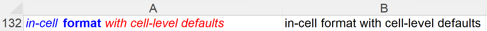

# How to Import Any Spreadsheet File into `R`: Using tidyxl and unpivotr

## Introduction

**Do you struggle with importing complex or messy spreadsheets into
`R`?** You are not alone. Many data analysts and researchers face this
challenge every day.

Spreadsheets are widely used for storing, manipulating, and presenting
data in various domains and applications. However, ***not all
spreadsheets are created equal***. Some of them may contain multiple
tables, merged cells, headers, footers, comments, formulas, formatting,
or other features that make them difficult to import into `R` using
conventional packages like `readxl`, `openxlsx` or `openxlsx2`.

But don’t worry, there is a better way using `tidyxl` and `unpivotr`.
These two packages work together to handle any spreadsheet file, no
matter how it looks, in a fast and reproducible way.

- `tidyxl` imports every cell as a row, preserving all the information
  and attributes of the original file.

- `unpivotr` reshapes the data into a tidy format that is suitable for
  analysis and visualization.

In this blog post, **I will show you how to use these two packages to
import any spreadsheet file into `R` with ease and confidence** taking
your data analysis skills to the next level.

## Loading environment’s objects

1.  Libraries to use.

``` r
# To import data
library(tidyxl)

# To explore results of tidyxl
library(data.table)

# To transform the results
library(unpivotr)
```

2.  Datasets to use.

- Different cells spreadsheet


``` r
DiffCellsPath <- system.file(
  "extdata/examples.xlsx", 
  package = "tidyxl"
)

DiffCells <- xlsx_cells(DiffCellsPath, sheets = "Sheet1")
DiffCellsFormats <- xlsx_formats(DiffCellsPath)

setDT(DiffCells)
setkey(DiffCells, address)
```

- Sales Example


``` r
SalesCells <- xlsx_cells("data/annual_sales.xlsx")

setDT(SalesCells)
```

## Exploring results from tidyxl

To understand how to use this approach, we need to understand the
results of `xlsx_cells` column by column and how they relate to the
`xlsx_formats` results.

As some columns have similar objectives, we are going to explain the
result category.

### Cells’ position

- **sheet**: The worksheet that the cell is from.
- **address**: The cell address in A1 notation.
- **row**: The row number of a cell address (integer).
- **col**: The column number of a cell address (integer).

``` r
DiffCells[1:6, .(sheet,address, row, col)]
```

        sheet address row col
    1: Sheet1      A1   1   1
    2: Sheet1     A10  10   1
    3: Sheet1    A100 100   1
    4: Sheet1    A101 101   1
    5: Sheet1    A102 102   1
    6: Sheet1    A103 103   1

### Cells’ content type

- **data_type**: The type of a cell, referring to the following columns:
  error, logical, numeric, date, character, blank.
- **is_blank**: It’s `TRUE` if the cell has a value.
- **content**: Raw cell value before type conversion. It may be:
  - A numeric value
  - A data/datetime in one of the Excel’s date/datetime systems.
  - An index into an internal table of strings.

``` r
DiffCells[, .SD[1:2],
             by = "data_type",
             .SDcols = c("is_blank", "content")]
```

        data_type is_blank             content
     1:     error    FALSE             #DIV/0!
     2:     error    FALSE              #NAME?
     3: character    FALSE                 107
     4: character    FALSE                 137
     5:   numeric    FALSE                   0
     6:   numeric    FALSE                   0
     7:      date    FALSE               42736
     8:      date    FALSE 0.35416666666666669
     9:     blank     TRUE                <NA>
    10:     blank     TRUE                <NA>
    11:   logical    FALSE                   1
    12:   logical    FALSE                   1

### Cells’ content

- **error**: The error value of a cell.
- **logical**: The boolean value of a cell.
- **numeric**: The numeric value of a cell.
- **date**: The date value of a cell.
- **character**: The string value of a cell.
- **comment**: The text of a comment attached to a cell.

``` r
ValueCols <- c(
  "error",
  "character",
  "logical",
  "numeric",
  "date",
  "comment"
)

DiffCells[is_blank == FALSE, 
             .SD[order(is.na(comment))][1:2],
             by = "data_type",
             .SDcols = ValueCols]
```

        data_type   error                                               character
     1:     error #DIV/0!                                                    <NA>
     2:     error  #NAME?                                                    <NA>
     3: character    <NA>                                                 comment
     4: character    <NA> Data validation, list, in-cell dropdown, warning symbol
     5:   numeric    <NA>                                                    <NA>
     6:   numeric    <NA>                                                    <NA>
     7:      date    <NA>                                                    <NA>
     8:      date    <NA>                                                    <NA>
     9:   logical    <NA>                                                    <NA>
    10:   logical    <NA>                                                    <NA>
        logical numeric                date                   comment
     1:      NA      NA                <NA>                      <NA>
     2:      NA      NA                <NA>                      <NA>
     3:      NA      NA                <NA> commentwithtextformatting
     4:      NA      NA                <NA>                      <NA>
     5:      NA       0                <NA>                      <NA>
     6:      NA       0                <NA>                      <NA>
     7:      NA      NA 2017-01-01 00:00:00                      <NA>
     8:      NA      NA 1899-12-31 08:30:00                      <NA>
     9:    TRUE      NA                <NA>                      <NA>
    10:    TRUE      NA                <NA>                      <NA>

### Cells’ formulas


- **formula**: Shows as a text the formula used to return any value
  after removing braces `{}` for array functions.
- **formula_group**: When 2 cells has the same function or just changing
  by cell reference then Excel only the write the formula once in the
  document and `tidyxl`infers the group for those cases.
- **formula_ref**: The address of a range of cells group to which an
  **array** formula or **shared** formula applies.
- **is_array**: Whether or not the formula is an array formula. In
  `A22`the result is presented in the same cell, but for `A23` the
  result is displayed in cells `A23:A24`.

``` r
DiffCells[.(address = c(paste0("A",19:21),
                        paste0("B",19:21),
                        paste0("A",22:24))),
             .(address,
               formula,
               formula_group,
               formula_ref,
               is_array)]
```

       address              formula formula_group formula_ref is_array
    1:     A19              $A$18+1            NA        <NA>    FALSE
    2:     A20              $A$18+1             0     A20:A21    FALSE
    3:     A21              $A$18+1             0        <NA>    FALSE
    4:     B19                A18+2            NA        <NA>    FALSE
    5:     B20                A19+2             1     B20:B21    FALSE
    6:     B21                A20+2             1        <NA>    FALSE
    7:     A22 SUM(A19:A21*B19:B21)            NA         A22     TRUE
    8:     A23      A19:A20*B19:B20            NA     A23:A24     TRUE
    9:     A24                 <NA>            NA        <NA>    FALSE

### Describing substrings’ formatting

- **character_formatted**: As a single cell can contain *substrings with
  different formatting*, each `character` cell has a `tibble` with one
  row per substring.

  - If a cell has many words but one format for all of them, this column
    will return a `tibble` with a single row, as we can see for cells
    `A108`, `A109`, `A112`, `A133` and `A134`, and if we unnest the
    columns we can only see `NA`.

``` r
SubstringsWithDefault <-
  DiffCells[.(address = paste0("A", c(108,109,112,133,134))), 
            .(address,
              character,
              character_formatted)]

SubstringsWithDefault
```

       address                                               character
    1:    A108 Data validation, list, in-cell dropdown, warning symbol
    2:    A109 Data validation, list, in-cell dropdown, warning symbol
    3:    A112                                               some text
    4:    A133                             underline single accounting
    5:    A134                             underline double accounting
       character_formatted
    1:      <tbl_df[1x14]>
    2:      <tbl_df[1x14]>
    3:      <tbl_df[1x14]>
    4:      <tbl_df[1x14]>
    5:      <tbl_df[1x14]>

``` r
SubstringsWithDefault[, character_formatted[[1L]],
                      by = "address"]
```

       address                                               character bold italic
    1:    A108 Data validation, list, in-cell dropdown, warning symbol   NA     NA
    2:    A109 Data validation, list, in-cell dropdown, warning symbol   NA     NA
    3:    A112                                               some text   NA     NA
    4:    A133                             underline single accounting   NA     NA
    5:    A134                             underline double accounting   NA     NA
       underline strike vertAlign size color_rgb color_theme color_indexed
    1:      <NA>     NA      <NA>   NA      <NA>          NA            NA
    2:      <NA>     NA      <NA>   NA      <NA>          NA            NA
    3:      <NA>     NA      <NA>   NA      <NA>          NA            NA
    4:      <NA>     NA      <NA>   NA      <NA>          NA            NA
    5:      <NA>     NA      <NA>   NA      <NA>          NA            NA
       color_tint font family scheme
    1:         NA <NA>     NA   <NA>
    2:         NA <NA>     NA   <NA>
    3:         NA <NA>     NA   <NA>
    4:         NA <NA>     NA   <NA>
    5:         NA <NA>     NA   <NA>

- But exploring the cell `A132` we can see how the `tibble` breaks the
  cell in **3 rows** representing different substring’s formats.



- - **in-cell** is *italic* and <span style="color:#0000ff"> blue
    </span>.
  - **format** is **bold** and <span style="color:#0000ff"> blue
    </span>.
  - **with cell-level defaults** is *italic* and
    <span style="color:#ff0000"> red </span>.

``` r
DiffCells[address == "A132", 
          as.data.table(character_formatted[[1L]])
# To avoid printing columns with a single value
][, .SD, .SDcols = \(x) uniqueN(x) > 1L]
```

                       character  bold italic color_rgb
    1:                  in-cell  FALSE   TRUE  FF0000FF
    2:                    format  TRUE  FALSE  FF0000FF
    3:  with cell-level defaults FALSE   TRUE  FFFF0000

### Describing cells’ dimensions

- We all can see the dimensions of each cell.

``` r
DiffCells[width == 8.38,
          .(address, 
               height, 
               width,
               row_outline_level,
               col_outline_level)]
```

       address height width row_outline_level col_outline_level
    1:    D173  14.25  8.38                 1                 1
    2:    E173  14.25  8.38                 1                 1
    3:    F173  14.25  8.38                 1                 1
    4:    G173  14.25  8.38                 1                 1

``` r
DiffCells[address == "A132",
             .(address, 
               height, 
               width,
               row_outline_level,
               col_outline_level)]
```

       address height  width row_outline_level col_outline_level
    1:    A132     15 19.375                 1                 1
