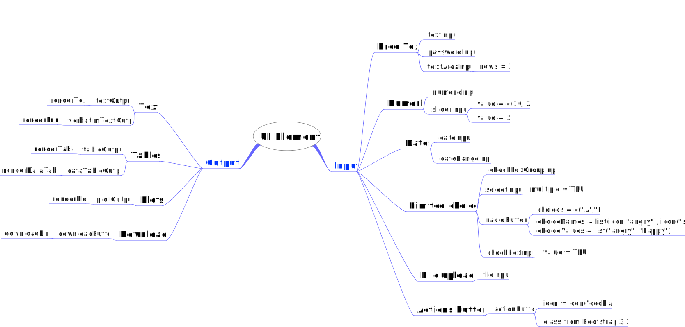

# 2. Basic UI

- [Mind Map Summary](#mind-map-summary)
- [2.2.8. Exercises](#exercises)
- [2.3.5. Exercises](#exercises-1)

## Mind Map Summary



## 2.2.8. Exercises

1.  When space is at a premium, it’s useful to label text boxes using a
    placeholder that appears inside the text entry area. How do you call
    `textInput()` to generate the UI below?


**Solution**

``` r
library(shiny)

ui <- fluidPage(
  textInput("name","Name", placeholder = "Your name")
)

server <- function(input, output, session){
}

#Run
shinyApp(ui, server)
```

2.  Carefully read the documentation for sliderInput() to figure out how
    to create a date slider, as shown below.


**Solution**

``` r
library(shiny)

ui <- fluidPage(
  sliderInput(
    "deliver_date",
    "When should we deliver?",
    min = as.Date("2020-09-16"),
    max = as.Date("2020-09-23"),
    value = as.Date("2020-09-17"))
)

server <- function(input, output, session){
}

#Run
shinyApp(ui, server)
```

3.  Create a slider input to select values between 0 and 100 where the
    interval between each selectable value on the slider is 5. Then, add
    animation to the input widget so when the user presses play the
    input widget scrolls through the range automatically.

**Solution**

``` r
library(shiny)

ui <- fluidPage(
  sliderInput(
    "value",
    "Select a value",
    min = 0,
    max = 100,
    value = 0,
    step = 5,
    animate = TRUE)
)

server <- function(input, output, session){
}

#Run
shinyApp(ui, server)
```

4.  If you have a moderately long list in a selectInput(), it’s useful
    to create sub-headings that break the list up into pieces. Read the
    documentation to figure out how. (Hint: the underlying HTML is
    called <optgroup>.)

**Solution**

``` r
library(shiny)


quarter_list <-
  matrix(month.name, ncol = 4) |>
  (\(M) lapply(1:ncol(M),\(y) M[,y]))()

names(quarter_list) <- paste0("Q",1:4)

ui <- fluidPage(
  selectInput(
    "month_name",
    "Select a month",
    choices = quarter_list
  )
)

server <- function(input, output, session){
}

#Run
shinyApp(ui, server)
```

## 2.3.5. Exercises

1.  Which of textOutput() and verbatimTextOutput() should each of the
    following render functions be paired with?

|                 **Question**                 |     **Solution**     |
|:--------------------------------------------:|:--------------------:|
|         renderPrint(summary(mtcars))         | verbatimTextOutput() |
|         renderText(“Good morning!”)          |     textOutput()     |
|        renderPrint(t.test(1:5, 2:6))         | verbatimTextOutput() |
| renderText(str(lm(mpg ~ wt, data = mtcars))) | verbatimTextOutput() |

2.  Re-create the Shiny app from Section 2.3.3, this time setting height
    to 300px and width to 700px. Set the plot “alt” text so that a
    visually impaired user can tell that its a scatterplot of five
    random numbers.

**Solution**

``` r
library(shiny)

ui <- fluidPage(
  plotOutput("plot", height = "300px", width = "700px")
)
server <- function(input, output, session) {
  output$plot <- renderPlot(
    plot(1:5),
    res = 96,
    alt = "Plotting 5 Random Numbers"
    )
}

#Run
shinyApp(ui, server)
```

3.  Update the options in the call to renderDataTable() below so that
    the data is displayed, but all other controls are suppress
    (i.e. remove the search, ordering, and filtering commands). You’ll
    need to read ?renderDataTable and review the options at
    https://datatables.net/reference/option/.

``` r
ui <- fluidPage(
  dataTableOutput("table")
)
server <- function(input, output, session) {
  output$table <- renderDataTable(mtcars, options = list(pageLength = 5))
}
```

**Solution**

``` r
library(shiny)

ui <- fluidPage(
  dataTableOutput("table")
)
server <- function(input, output, session) {
  output$table <- renderDataTable(
    mtcars,
    options = list(
      pageLength = 5,
      searching = FALSE,
      ordering = FALSE
    )
  )
}

#Run
shinyApp(ui, server)
```

**Solution**

``` r
library(shiny)
library(reactable)

ui <- fluidPage(
  reactableOutput("table")
)

server <- function(input, output) {
  output$table <- renderReactable({
    reactable(mtcars,
              defaultPageSize = 5)
  })
}

shinyApp(ui, server)
```
