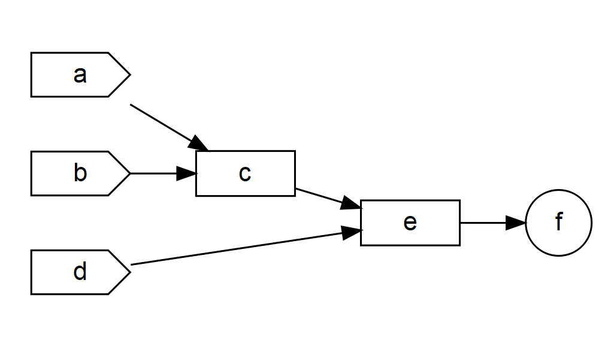
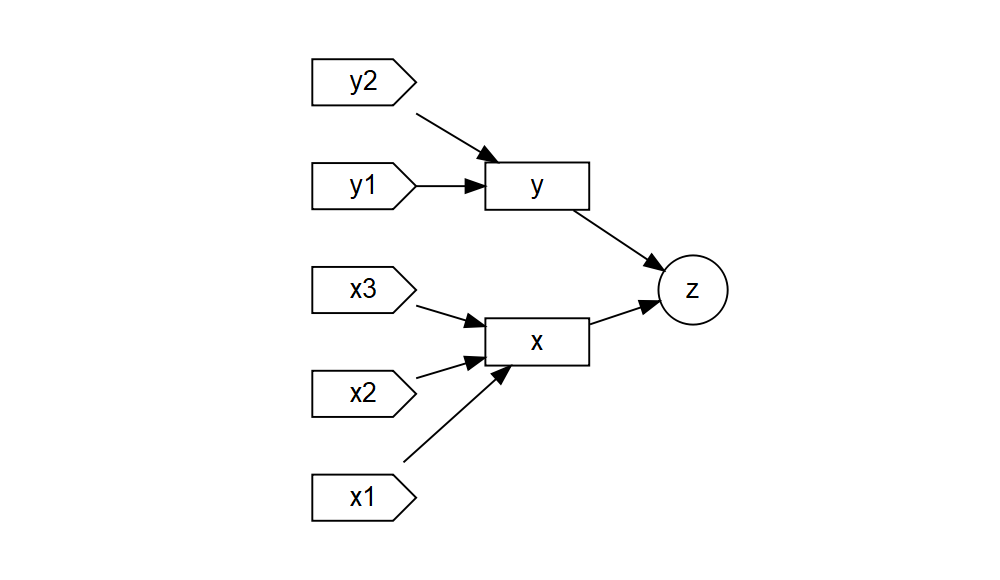
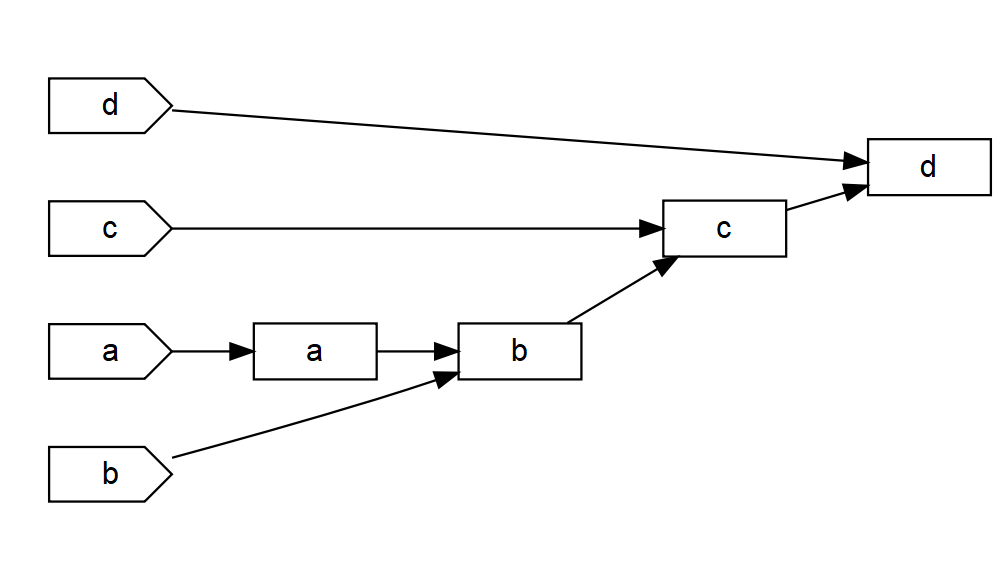

3. Basic Reactivity - Excercises
================

- <a href="#reactive-programming" id="toc-reactive-programming">Reactive
  programming</a>

## Reactive programming

1.  Given the next UI:

``` r
ui <- fluidPage(
  textInput("name", "What's your name?"),
  textOutput("greeting")
)
```

Fix the simple errors found in each of the three server functions below.
First try spotting the problem just by reading the code; then run the
code to make sure you’ve fixed it.

``` r
server1 <- function(input, output, server) {
  input$greeting <- renderText(paste0("Hello ", name))
}

server2 <- function(input, output, server) {
  greeting <- paste0("Hello ", input$name)
  output$greeting <- renderText(greeting)
}

server3 <- function(input, output, server) {
  output$greting <- paste0("Hello", input$name)
}
```

**Solution**

``` r
library(shiny)

ui <- fluidPage(
  textInput("name", "What's your name?"),
  textOutput("greeting")
)

# From server to session
server1 <- function(input, output, session) {
  # From input$greeting to output$greeting
  # From name to input$name
  output$greeting <- renderText(paste0("Hello ", input$name))
}

shinyApp(ui, server1)


# From server to session
server2 <- function(input, output, session) {
  # We need to add a reactive function
  greeting <- reactive(paste0("Hello ", input$name))
  # We need a parenthesis to call a reactive expression
  output$greeting <- renderText(greeting())
}

shinyApp(ui, server2)


# From server to session
server3 <- function(input, output, session) {
  # we need to call a render function
  # From output$greting to output$greeting
  # Missing a space in function paste0
  output$greeting <- renderText(paste0("Hello ", input$name))
}

shinyApp(ui, server3)
```

2.  Draw the reactive graph for the following server functions:

``` r
library(DiagrammeR)
```

    Warning: package 'DiagrammeR' was built under R version 4.2.3

**Solution**

``` r
server1 <- function(input, output, session) {
  c <- reactive(input$a + input$b)
  e <- reactive(c() + input$d)
  output$f <- renderText(e())
}
```

``` r
grViz("
digraph reactive_graph_1 {

  # General properties
  graph [rankdir = LR, fontsize = 10, overlap = true]


  # Defining input nodes
  node [shape = cds,
        fontname = Helvetica,
        rank = 1]
  a; b; d
  
  subgraph {
  rank = same; a; b; d;
  }
  
  
  # Defining Reactive Expressions
  node [shape = box,
        fontname = Helvetica,
        height = 0.15]
  c; e


  # Defining output
  node [shape = circle,
        width = 0.5]
  f

  # several 'edge' statements
  a -> c
  b -> c
  c -> e
  d -> e
  e -> f
}
")
```



``` r
server2 <- function(input, output, session) {
  x <- reactive(input$x1 + input$x2 + input$x3)
  y <- reactive(input$y1 + input$y2)
  output$z <- renderText(x() / y())
}
```

``` r
grViz("
digraph reactive_graph_2 {

  # General properties
  graph [rankdir = LR, fontsize = 10, overlap = true]


  # Defining input nodes
  node [shape = cds,
        fontname = Helvetica,
        rank = 1]
  y2; y1; x3; x2; x1
  
  subgraph {
  rank = same; y2; y1; x3; x2; x1
  }
  
  
  # Defining Reactive Expressions
  node [shape = box,
        fontname = Helvetica,
        height = 0.15]
  y; x


  # Defining output
  node [shape = circle,
        width = 0.5]
  z

  # several 'edge' statements
  {x1, x2, x3} -> x
  {y1, y2} -> y
  {x, y} -> z
}
")
```



``` r
server3 <- function(input, output, session) {
  d <- reactive(c() ^ input$d)
  a <- reactive(input$a * 10)
  c <- reactive(b() / input$c) 
  b <- reactive(a() + input$b)
}
```

``` r
grViz("
digraph reactive_graph_2 {

  # General properties
  graph [rankdir = LR, fontsize = 10, overlap = true]


  # Defining input nodes
  node [shape = cds,
        fontname = Helvetica,
        rank = 1]
  a; b; c; d
  
  subgraph {
  rank = same; a; b; c; d
  }
  
  
  # Defining Reactive Expressions
  node [shape = box,
        fontname = Helvetica,
        height = 0.15]
  ar[label = 'a']; br[label = 'b']; cr[label = 'c']; dr[label = 'd'];


  # several 'edge' statements
  a -> ar
  {ar, b} -> br
  {br, c} -> cr
  {cr, d} -> dr
  
}
")
```



3.  Why will this code fail?

``` r
var <- reactive(df[[input$var]])
range <- reactive(range(var(), na.rm = TRUE))
```

Why are range() and var() bad names for reactive?

**Solution**

As reactive expression needs to be called as functions at the moment of
calling `var()` `R` will return the `var` function, the same will happen
the `range` reactive expression.
