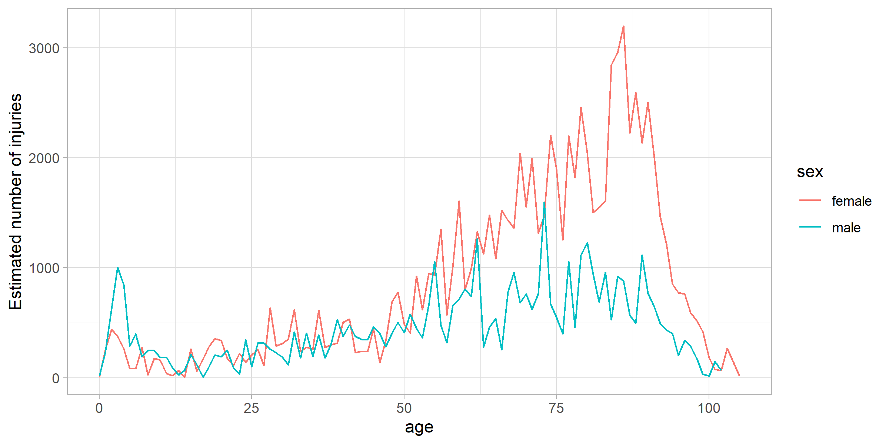
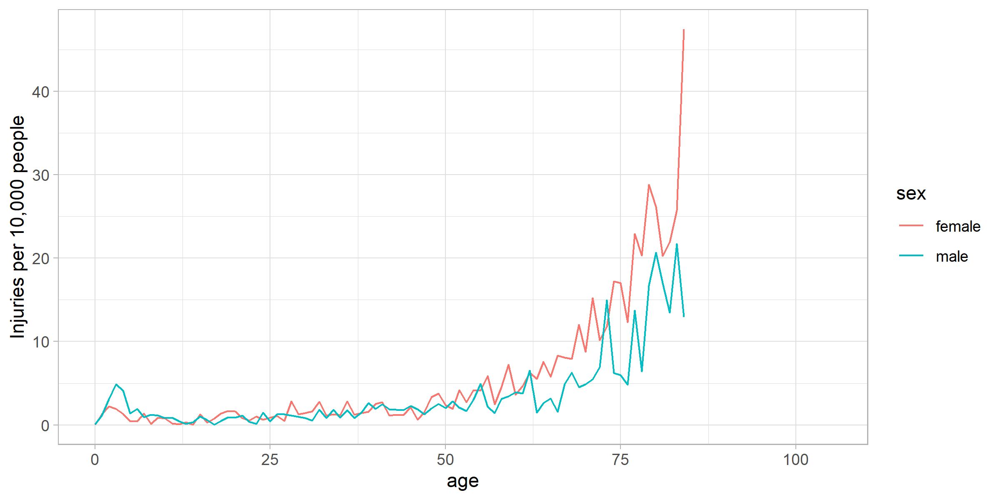

# 4. ER injuries

- [Loading libraries](#loading-libraries)
- [Importing data](#importing-data)
- [Exploration](#exploration)

## Loading libraries

``` r
library(shiny)
library(tidyverse)
theme_set(theme_light())
```

## Importing data

``` r
folder_path <- here::here("01-mastering-shiny/04_ER_injuries/neiss/")

injuries <- vroom::vroom(file.path(folder_path, "injuries.tsv.gz"))
products <- vroom::vroom(file.path(folder_path, "products.tsv"))
population <- vroom::vroom(file.path(folder_path, "population.tsv"))
```

## Exploration

``` r
injuries_toilet <- injuries |> filter(prod_code == 649)
```

- **Where can we experiment accidents related with toilets?**

``` r
injuries_toilet |>
  count(location, wt = weight, sort = TRUE)
```

    # A tibble: 6 × 2
      location                         n
      <chr>                        <dbl>
    1 Home                       99603. 
    2 Other Public Property      18663. 
    3 Unknown                    16267. 
    4 School                       659. 
    5 Street Or Highway             16.2
    6 Sports Or Recreation Place    14.8

- **What body part is affected?**

``` r
injuries_toilet|>
  count(body_part, wt = weight, sort = TRUE)
```

    # A tibble: 24 × 2
       body_part        n
       <chr>        <dbl>
     1 Head        31370.
     2 Lower Trunk 26855.
     3 Face        13016.
     4 Upper Trunk 12508.
     5 Knee         6968.
     6 N.S./Unk     6741.
     7 Lower Leg    5087.
     8 Shoulder     3590.
     9 All Of Body  3438.
    10 Ankle        3315.
    # ℹ 14 more rows

- **What is the final diagnosis?**

``` r
injuries_toilet |>
  count(diag, wt = weight, sort = TRUE) |>
  head()
```

    # A tibble: 6 × 2
      diag                       n
      <chr>                  <dbl>
    1 Other Or Not Stated   32897.
    2 Contusion Or Abrasion 22493.
    3 Inter Organ Injury    21525.
    4 Fracture              21497.
    5 Laceration            18734.
    6 Strain, Sprain         7609.

- **How many people have suffer from this result by sex and age?**

  - **Totals**

``` r
injuries_toilet |>
  count(age, sex, wt = weight, sort = TRUE) |>
  ggplot(aes(age, n, colour = sex)) +
  geom_line() +
  labs(y = "Estimated number of injuries")
```



- **Injure rate by 10,000 people**

``` r
injuries_toilet |>
  count(age, sex, wt = weight, sort = TRUE) |>
  left_join(population, by = c("age", "sex")) |>
  mutate(rate = n / population * 1e4) |>
  ggplot(aes(age, rate, colour = sex)) +
  geom_line(na.rm = TRUE) +
  labs(y = "Injuries per 10,000 people")
```



- **What can we learn from narratives?**

``` r
set.seed(125)

injuries_toilet |>
  filter(str_length(narrative) < 100) |>
  sample_n(5) |>
  pull(narrative)
```

    [1] "40YOF C/O VAGINAL PAIN AFTER USING FEMALE URINAL & HURT HERSELFDX:VAGINA CONSTS,BUTTOCK RASH"    
    [2] "75 YR OLD FEMALE  IN BATHROOM AND MISSED TOILET AND FELL TO FLOOR AND THEN HAD AN MI"            
    [3] "85YF WAS GETTING OFF OF WHEELCHAIR VS TOILET&FELL>>HAND LAC, RIB PAIN"                           
    [4] "15 YOF HAD A SEIZURE WHILE SITTING ON TOILET AND HIT HEAD ON BATHTUBDX  HEMATOMA"                
    [5] "64 YROLD FEMALE MOVING BOX ON COMMODE AND FOOT CAUGHT AND SHE FELL HITTING HEAD AND LAC FOREHEAD"

``` r
set.seed(NULL)
```
