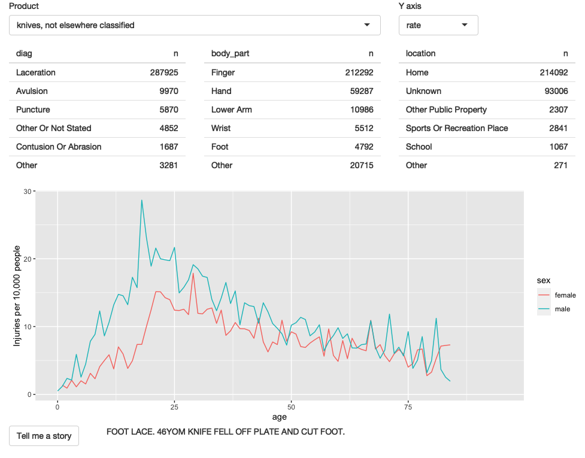
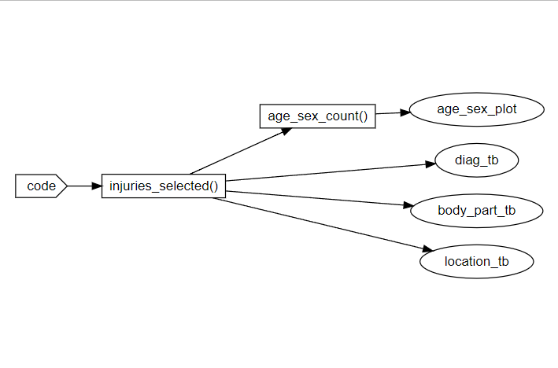

# 4. ER injuries

- [Loading libraries](#loading-libraries)
- [Importing data](#importing-data)
- [Exploration](#exploration)
- [Prototype](#prototype)
  - [Step 1: Placing base information](#step-1-placing-base-information)
  - [Step 2: Polish tables](#step-2-polish-tables)
  - [Step 3: Rate vs count](#step-3-rate-vs-count)
  - [Step 4: Narrative](#step-4-narrative)
- [Exercises](#exercises)

## Loading libraries

``` r
library(shiny)
library(tidyverse)
theme_set(theme_light())
```

## Importing data

``` r
folder_path <- here::here("01-mastering-shiny/04_ER_injuries/neiss/")

injuries <- vroom::vroom(file.path(folder_path, "injuries.tsv.gz"))
products <- vroom::vroom(file.path(folder_path, "products.tsv"))
population <- vroom::vroom(file.path(folder_path, "population.tsv"))
```

## Exploration

``` r
injuries_toilet <- injuries |> filter(prod_code == 649)
```

- **Where can we experiment accidents related with toilets?**

``` r
injuries_toilet |>
  count(location, wt = weight, sort = TRUE)
```

    # A tibble: 6 × 2
      location                         n
      <chr>                        <dbl>
    1 Home                       99603. 
    2 Other Public Property      18663. 
    3 Unknown                    16267. 
    4 School                       659. 
    5 Street Or Highway             16.2
    6 Sports Or Recreation Place    14.8

- **What body part is affected?**

``` r
injuries_toilet|>
  count(body_part, wt = weight, sort = TRUE)
```

    # A tibble: 24 × 2
       body_part        n
       <chr>        <dbl>
     1 Head        31370.
     2 Lower Trunk 26855.
     3 Face        13016.
     4 Upper Trunk 12508.
     5 Knee         6968.
     6 N.S./Unk     6741.
     7 Lower Leg    5087.
     8 Shoulder     3590.
     9 All Of Body  3438.
    10 Ankle        3315.
    # ℹ 14 more rows

- **What is the final diagnosis?**

``` r
injuries_toilet |>
  count(diag, wt = weight, sort = TRUE) |>
  head()
```

    # A tibble: 6 × 2
      diag                       n
      <chr>                  <dbl>
    1 Other Or Not Stated   32897.
    2 Contusion Or Abrasion 22493.
    3 Inter Organ Injury    21525.
    4 Fracture              21497.
    5 Laceration            18734.
    6 Strain, Sprain         7609.

- **How many people have suffer from this result by sex and age?**

  - **Totals**

``` r
injuries_toilet |>
  count(age, sex, wt = weight, sort = TRUE) |>
  ggplot(aes(age, n, colour = sex)) +
  geom_line() +
  labs(y = "Estimated number of injuries")
```


- **Injure rate by 10,000 people**

``` r
injuries_toilet |>
  count(age, sex, wt = weight, sort = TRUE) |>
  left_join(population, by = c("age", "sex")) |>
  mutate(rate = n / population * 1e4) |>
  ggplot(aes(age, rate, colour = sex)) +
  geom_line(na.rm = TRUE) +
  labs(y = "Injuries per 10,000 people")
```


- **What can we learn from narratives?**

``` r
set.seed(125)

injuries_toilet |>
  filter(str_length(narrative) < 100) |>
  sample_n(5) |>
  pull(narrative)
```

    [1] "40YOF C/O VAGINAL PAIN AFTER USING FEMALE URINAL & HURT HERSELFDX:VAGINA CONSTS,BUTTOCK RASH"    
    [2] "75 YR OLD FEMALE  IN BATHROOM AND MISSED TOILET AND FELL TO FLOOR AND THEN HAD AN MI"            
    [3] "85YF WAS GETTING OFF OF WHEELCHAIR VS TOILET&FELL>>HAND LAC, RIB PAIN"                           
    [4] "15 YOF HAD A SEIZURE WHILE SITTING ON TOILET AND HIT HEAD ON BATHTUBDX  HEMATOMA"                
    [5] "64 YROLD FEMALE MOVING BOX ON COMMODE AND FOOT CAUGHT AND SHE FELL HITTING HEAD AND LAC FOREHEAD"

``` r
set.seed(NULL)
```

## Prototype

Once we know what we need:

- Input
  - Product code
- Output
- 1 Plot
- 3 Tables

We can create a **pencil-and-paper sketch** and define the **reactive
graph** before start coding.

### Step 1: Placing base information

``` r
prod_codes <- setNames(products$prod_code, products$title)

ui <- fluidPage(
  fluidRow(
    column(6,
      selectInput("code", "Product", choices = prod_codes)
    )
  ),
  fluidRow(
    column(4, tableOutput("diag_tb")),
    column(4, tableOutput("body_part_tb")),
    column(4, tableOutput("location_tb"))
  ),
  fluidRow(
    column(12, plotOutput("age_sex_plot"))
  )
)

server <- function(input, output, session) {
  
  injuries_selected <- reactive({
    injuries |> filter(prod_code == input$code)
  })
  
  output$diag_tb <- renderTable({
    injuries_selected() |>
      count(diag, wt = weight, sort = TRUE)
  })
  
  output$body_part_tb <- renderTable({
    injuries_selected() |>
      count(body_part, wt = weight, sort = TRUE)
  })
  
  output$location_tb <- renderTable({
    injuries_selected() |>
      count(location, wt = weight, sort = TRUE)
  })
  
  # Just to keep computing and plotting separate
  age_sex_count <- reactive({
    injuries_selected() |>
      count(age, sex, wt = weight, sort = TRUE)
  })
  
  
  output$age_sex_plot <- renderPlot({
    age_sex_count() |>
      ggplot(aes(age, n, colour = sex)) +
      geom_line(na.rm = TRUE) +
      labs(y = "Estimated number of injuries")
  }, res = 96)
    
}

shinyApp(ui, server)
```


### Step 2: Polish tables

``` r
count_top <- function(df, var, n = 5) {
  df |>
    mutate({{ var }} := fct_lump(fct_infreq({{ var }}), n = n)) |>
    group_by({{ var }}) |>
    summarise(n = as.integer(sum(weight)))
}

prod_codes <- setNames(products$prod_code, products$title)

ui <- fluidPage(
  fluidRow(
    column(6,
      selectInput("code", "Product", choices = prod_codes)
    )
  ),
  fluidRow(
    column(4, tableOutput("diag_tb")),
    column(4, tableOutput("body_part_tb")),
    column(4, tableOutput("location_tb"))
  ),
  fluidRow(
    column(12, plotOutput("age_sex_plot"))
  )
)

server <- function(input, output, session) {
  
  injuries_selected <- reactive({
    injuries |> filter(prod_code == input$code)
  })
  
  output$diag_tb <- renderTable(
    count_top(injuries_selected(), diag),
    width = "100%"
  )
  
  output$body_part_tb <- renderTable(
    count_top(injuries_selected(), body_part),
    width = "100%"
  )
  
  output$location_tb <- renderTable(
    count_top(injuries_selected(), location),
    width = "100%"
  )
  
  # Just to keep computing and plotting separate
  age_sex_count <- reactive({
    injuries_selected() |>
      count(age, sex, wt = weight, sort = TRUE)
  })
  
  
  output$age_sex_plot <- renderPlot({
    age_sex_count() |>
      ggplot(aes(age, n, colour = sex)) +
      geom_line(na.rm = TRUE) +
      labs(y = "Estimated number of injuries")
  }, res = 96)
    
}

shinyApp(ui, server)
```


### Step 3: Rate vs count

``` r
count_top <- function(df, var, n = 5) {
  df |>
    mutate({{ var }} := fct_lump(fct_infreq({{ var }}), n = n)) |>
    group_by({{ var }}) |>
    summarise(n = as.integer(sum(weight)))
}

prod_codes <- setNames(products$prod_code, products$title)

ui <- fluidPage(
  fluidRow(
    column(8,
      selectInput("code", "Product",
        choices = setNames(products$prod_code, products$title),
        width = "100%"
      )
    ),
    column(2, selectInput("metric", "Y axis", c("rate", "count")))
  ),
  fluidRow(
    column(4, tableOutput("diag_tb")),
    column(4, tableOutput("body_part_tb")),
    column(4, tableOutput("location_tb"))
  ),
  fluidRow(
    column(12, plotOutput("age_sex_plot"))
  )
)

server <- function(input, output, session) {
  
  injuries_selected <- reactive({
    injuries |> filter(prod_code == input$code)
  })
  
  output$diag_tb <- renderTable(
    count_top(injuries_selected(), diag),
    width = "100%"
  )
  
  output$body_part_tb <- renderTable(
    count_top(injuries_selected(), body_part),
    width = "100%"
  )
  
  output$location_tb <- renderTable(
    count_top(injuries_selected(), location),
    width = "100%"
  )
  
  # Now if the we change from count to rate
  # shiny doesn't need to update this part
  # just to update the plot
  age_sex_summary <- reactive({
    injuries_selected() |>
      count(age, sex, wt = weight, sort = TRUE) |>
      left_join(population, by = c("age", "sex")) |>
      mutate(rate = n / population * 1e4)
  })
  
  
  output$age_sex_plot <- renderPlot({
    if (input$metric == "count") {
      age_sex_summary() |>
        ggplot(aes(age, n, colour = sex)) +
        geom_line() +
        labs(y = "Estimated number of injuries")
    } else {
      age_sex_summary() |>
        ggplot(aes(age, rate, colour = sex)) +
        geom_line(na.rm = TRUE) +
        labs(y = "Injuries per 10,000 people")
    }
  }, res = 96)
    
}

shinyApp(ui, server)
```


### Step 4: Narrative

``` r
count_top <- function(df, var, n = 5) {
  df |>
    mutate({{ var }} := fct_lump(fct_infreq({{ var }}), n = n)) |>
    group_by({{ var }}) |>
    summarise(n = as.integer(sum(weight)))
}

prod_codes <- setNames(products$prod_code, products$title)

ui <- fluidPage(
  fluidRow(
    column(8,
      selectInput("code", "Product",
        choices = setNames(products$prod_code, products$title),
        width = "100%"
      )
    ),
    column(2, selectInput("metric", "Y axis", c("rate", "count")))
  ),
  fluidRow(
    column(4, tableOutput("diag_tb")),
    column(4, tableOutput("body_part_tb")),
    column(4, tableOutput("location_tb"))
  ),
  fluidRow(
    column(12, plotOutput("age_sex_plot"))
  ),
  fluidRow(
    column(2, actionButton("story", "Tell me a story")),
    column(10, textOutput("narrative"))
  )
)

server <- function(input, output, session) {
  
  injuries_selected <- reactive({
    injuries |> filter(prod_code == input$code)
  })
  
  output$diag_tb <- renderTable(
    count_top(injuries_selected(), diag),
    width = "100%"
  )
  
  output$body_part_tb <- renderTable(
    count_top(injuries_selected(), body_part),
    width = "100%"
  )
  
  output$location_tb <- renderTable(
    count_top(injuries_selected(), location),
    width = "100%"
  )
  
  # Now if the we change from count to rate
  # shiny doesn't need to update this part
  # just to update the plot
  age_sex_summary <- reactive({
    injuries_selected() |>
      count(age, sex, wt = weight, sort = TRUE) |>
      left_join(population, by = c("age", "sex")) |>
      mutate(rate = n / population * 1e4)
  })
  
  
  output$age_sex_plot <- renderPlot({
    if (input$metric == "count") {
      age_sex_summary() |>
        ggplot(aes(age, n, colour = sex)) +
        geom_line() +
        labs(y = "Estimated number of injuries")
    } else {
      age_sex_summary() |>
        ggplot(aes(age, rate, colour = sex)) +
        geom_line(na.rm = TRUE) +
        labs(y = "Injuries per 10,000 people")
    }
  }, res = 96)
  
  
  narrative_sample <- eventReactive(
    # Re-evaluated whenever either input$story or selected() changes
    list(input$story, injuries_selected()),
    # Text to show
    injuries_selected() |> pull(narrative) |> sample(1)
  )
  
  output$narrative <- renderText(narrative_sample())
    
}

shinyApp(ui, server)
```



## Exercises

1.  Draw the reactive graph for each app.

**Step 1 and 2: Placing base information and Polish tables**



**Step 3: Rate vs count**


**Step 4: Narrative**


2.  What happens if you flip fct_infreq() and fct_lump() in the code
    that reduces the summary tables?

The table results were affected as the `other` level isn’t any more the
last one and was assigned based on alphabetical order.

``` r
count_top <- function(df, var, n = 5) {
  df |>
    mutate({{ var }} := fct_infreq(fct_lump({{ var }}, n = n))) |>
    group_by({{ var }}) |>
    summarise(n = as.integer(sum(weight)))
}

prod_codes <- setNames(products$prod_code, products$title)

ui <- fluidPage(
  fluidRow(
    column(8,
      selectInput("code", "Product",
        choices = setNames(products$prod_code, products$title),
        width = "100%"
      )
    ),
    column(2, selectInput("metric", "Y axis", c("rate", "count")))
  ),
  fluidRow(
    column(4, tableOutput("diag_tb")),
    column(4, tableOutput("body_part_tb")),
    column(4, tableOutput("location_tb"))
  ),
  fluidRow(
    column(12, plotOutput("age_sex_plot"))
  )
)

server <- function(input, output, session) {
  
  injuries_selected <- reactive({
    injuries |> filter(prod_code == input$code)
  })
  
  output$diag_tb <- renderTable(
    count_top(injuries_selected(), diag),
    width = "100%"
  )
  
  output$body_part_tb <- renderTable(
    count_top(injuries_selected(), body_part),
    width = "100%"
  )
  
  output$location_tb <- renderTable(
    count_top(injuries_selected(), location),
    width = "100%"
  )
  
  # Now if the we change from count to rate
  # shiny doesn't need to update this part
  # just to update the plot
  age_sex_summary <- reactive({
    injuries_selected() |>
      count(age, sex, wt = weight, sort = TRUE) |>
      left_join(population, by = c("age", "sex")) |>
      mutate(rate = n / population * 1e4)
  })
  
  
  output$age_sex_plot <- renderPlot({
    if (input$metric == "count") {
      age_sex_summary() |>
        ggplot(aes(age, n, colour = sex)) +
        geom_line() +
        labs(y = "Estimated number of injuries")
    } else {
      age_sex_summary() |>
        ggplot(aes(age, rate, colour = sex)) +
        geom_line(na.rm = TRUE) +
        labs(y = "Injuries per 10,000 people")
    }
  }, res = 96)
    
}

shinyApp(ui, server)
```


3.  Add an input control that lets the user decide how many rows to show
    in the summary tables.

``` r
count_top <- function(df, var, n = 5) {
  df |>
    mutate({{ var }} := fct_lump(fct_infreq({{ var }}), n = n)) |>
    group_by({{ var }}) |>
    summarise(n = as.integer(sum(weight)))
}

prod_codes <- setNames(products$prod_code, products$title)

ui <- fluidPage(
  fluidRow(
    column(8,
      selectInput("code", "Product",
        choices = setNames(products$prod_code, products$title),
        width = "100%"
      )
    ),
    column(2, selectInput("metric", "Y axis", c("rate", "count"))),
    column(2, numericInput("n_rows", "Rows to display", 5L))
  ),
  fluidRow(
    column(4, tableOutput("diag_tb")),
    column(4, tableOutput("body_part_tb")),
    column(4, tableOutput("location_tb"))
  ),
  fluidRow(
    column(12, plotOutput("age_sex_plot"))
  ),
  fluidRow(
    column(2, actionButton("story", "Tell me a story")),
    column(10, textOutput("narrative"))
  )
)

server <- function(input, output, session) {
  
  injuries_selected <- reactive({
    injuries |> filter(prod_code == input$code)
  })
  
  output$diag_tb <- renderTable(
    count_top(injuries_selected(), diag, input$n_rows),
    width = "100%"
  )
  
  output$body_part_tb <- renderTable(
    count_top(injuries_selected(), body_part, input$n_rows),
    width = "100%"
  )
  
  output$location_tb <- renderTable(
    count_top(injuries_selected(), location, input$n_rows),
    width = "100%"
  )
  
  # Now if the we change from count to rate
  # shiny doesn't need to update this part
  # just to update the plot
  age_sex_summary <- reactive({
    injuries_selected() |>
      count(age, sex, wt = weight, sort = TRUE) |>
      left_join(population, by = c("age", "sex")) |>
      mutate(rate = n / population * 1e4)
  })
  
  
  output$age_sex_plot <- renderPlot({
    if (input$metric == "count") {
      age_sex_summary() |>
        ggplot(aes(age, n, colour = sex)) +
        geom_line() +
        labs(y = "Estimated number of injuries")
    } else {
      age_sex_summary() |>
        ggplot(aes(age, rate, colour = sex)) +
        geom_line(na.rm = TRUE) +
        labs(y = "Injuries per 10,000 people")
    }
  }, res = 96)
  
  
  narrative_sample <- eventReactive(
    # Re-evaluated whenever either input$story or selected() changes
    list(input$story, injuries_selected()),
    # Text to show
    injuries_selected() |> pull(narrative) |> sample(1)
  )
  
  output$narrative <- renderText(narrative_sample())
    
}

shinyApp(ui, server)
```


4.  Provide a way to step through every narrative systematically with
    forward and backward buttons.

``` r
count_top <- function(df, var, n = 5) {
  df |>
    mutate({{ var }} := fct_lump(fct_infreq({{ var }}), n = n)) |>
    group_by({{ var }}) |>
    summarise(n = as.integer(sum(weight)))
}

prod_codes <- setNames(products$prod_code, products$title)

ui <- fluidPage(
  fluidRow(
    column(8,
      selectInput("code", "Product",
        choices = setNames(products$prod_code, products$title),
        width = "100%"
      )
    ),
    column(2, selectInput("metric", "Y axis", c("rate", "count"))),
    column(2, numericInput("n_rows", "Rows to display", 5L))
  ),
  fluidRow(
    column(4, tableOutput("diag_tb")),
    column(4, tableOutput("body_part_tb")),
    column(4, tableOutput("location_tb"))
  ),
  fluidRow(
    column(12, plotOutput("age_sex_plot"))
  ),
  fluidRow(
    column(2, actionButton("backward", "Backward")),
    column(2, actionButton("forward", "Forward")),
    column(8, textOutput("narrative"))
  )
)

server <- function(input, output, session) {
  
  injuries_selected <- reactive({
    injuries |> filter(prod_code == input$code)
  })
  
  output$diag_tb <- renderTable(
    count_top(injuries_selected(), diag, input$n_rows),
    width = "100%"
  )
  
  output$body_part_tb <- renderTable(
    count_top(injuries_selected(), body_part, input$n_rows),
    width = "100%"
  )
  
  output$location_tb <- renderTable(
    count_top(injuries_selected(), location, input$n_rows),
    width = "100%"
  )
  
  # Now if the we change from count to rate
  # shiny doesn't need to update this part
  # just to update the plot
  age_sex_summary <- reactive({
    injuries_selected() |>
      count(age, sex, wt = weight, sort = TRUE) |>
      left_join(population, by = c("age", "sex")) |>
      mutate(rate = n / population * 1e4)
  })
  
  
  output$age_sex_plot <- renderPlot({
    if (input$metric == "count") {
      age_sex_summary() |>
        ggplot(aes(age, n, colour = sex)) +
        geom_line() +
        labs(y = "Estimated number of injuries")
    } else {
      age_sex_summary() |>
        ggplot(aes(age, rate, colour = sex)) +
        geom_line(na.rm = TRUE) +
        labs(y = "Injuries per 10,000 people")
    }
  }, res = 96)
  
  max_rows <- reactive(injuries_selected() |> nrow())
  
  narrative_step <- reactiveVal(1L)
  
  observeEvent(
    list(input$code, injuries_selected()), 
    narrative_step(1L)
  )
  
  observeEvent(input$backward,{
    x <- narrative_step() - 1L
    x <- if(x < 1) 1L else x
    narrative_step(x)
  })
  
  observeEvent(input$forward,{
    x <- narrative_step() + 1L
    x <- if(x > max_rows()) max_rows() else x
    narrative_step(x)
  })
  
  narrative_sample <- reactive(
    injuries_selected() |> 
      pull(narrative) |>
      (\(x) x[narrative_step()])() |>
      paste0("Narrative ", narrative_step(), ": ", a = _)
  )
  
  output$narrative <- renderText(narrative_sample())
    
}

shinyApp(ui, server)
```


5.  Make the list of narratives “circular” so that advancing forward
    from the last narrative takes you to the first.

``` r
count_top <- function(df, var, n = 5) {
  df |>
    mutate({{ var }} := fct_lump(fct_infreq({{ var }}), n = n)) |>
    group_by({{ var }}) |>
    summarise(n = as.integer(sum(weight)))
}

prod_codes <- setNames(products$prod_code, products$title)

ui <- fluidPage(
  fluidRow(
    column(8,
      selectInput("code", "Product",
        choices = setNames(products$prod_code, products$title),
        width = "100%"
      )
    ),
    column(2, selectInput("metric", "Y axis", c("rate", "count"))),
    column(2, numericInput("n_rows", "Rows to display", 5L))
  ),
  fluidRow(
    column(4, tableOutput("diag_tb")),
    column(4, tableOutput("body_part_tb")),
    column(4, tableOutput("location_tb"))
  ),
  fluidRow(
    column(12, plotOutput("age_sex_plot"))
  ),
  fluidRow(
    column(2, actionButton("backward", "Backward")),
    column(2, actionButton("forward", "Forward")),
    column(8, textOutput("narrative"))
  )
)

server <- function(input, output, session) {
  
  injuries_selected <- reactive({
    injuries |> filter(prod_code == input$code)
  })
  
  output$diag_tb <- renderTable(
    count_top(injuries_selected(), diag, input$n_rows),
    width = "100%"
  )
  
  output$body_part_tb <- renderTable(
    count_top(injuries_selected(), body_part, input$n_rows),
    width = "100%"
  )
  
  output$location_tb <- renderTable(
    count_top(injuries_selected(), location, input$n_rows),
    width = "100%"
  )
  
  # Now if the we change from count to rate
  # shiny doesn't need to update this part
  # just to update the plot
  age_sex_summary <- reactive({
    injuries_selected() |>
      count(age, sex, wt = weight, sort = TRUE) |>
      left_join(population, by = c("age", "sex")) |>
      mutate(rate = n / population * 1e4)
  })
  
  
  output$age_sex_plot <- renderPlot({
    if (input$metric == "count") {
      age_sex_summary() |>
        ggplot(aes(age, n, colour = sex)) +
        geom_line() +
        labs(y = "Estimated number of injuries")
    } else {
      age_sex_summary() |>
        ggplot(aes(age, rate, colour = sex)) +
        geom_line(na.rm = TRUE) +
        labs(y = "Injuries per 10,000 people")
    }
  }, res = 96)
  
  max_rows <- reactive(injuries_selected() |> nrow())
  
  narrative_step <- reactiveVal(1L)
  
  observeEvent(
    list(input$code, injuries_selected()), 
    narrative_step(1L)
  )
  
  observeEvent(input$backward,{
    x <- narrative_step() - 1L
    x <- if(x < 1) max_rows() else x
    narrative_step(x)
  })
  
  observeEvent(input$forward,{
    x <- narrative_step() + 1L
    x <- if(x > max_rows()) 1L else x
    narrative_step(x)
  })
  
  narrative_sample <- reactive(
    injuries_selected() |> 
      pull(narrative) |>
      (\(x) x[narrative_step()])() |>
      paste0("Narrative ", narrative_step(), ": ", a = _)
  )
  
  output$narrative <- renderText(narrative_sample())
    
}

shinyApp(ui, server)
```


