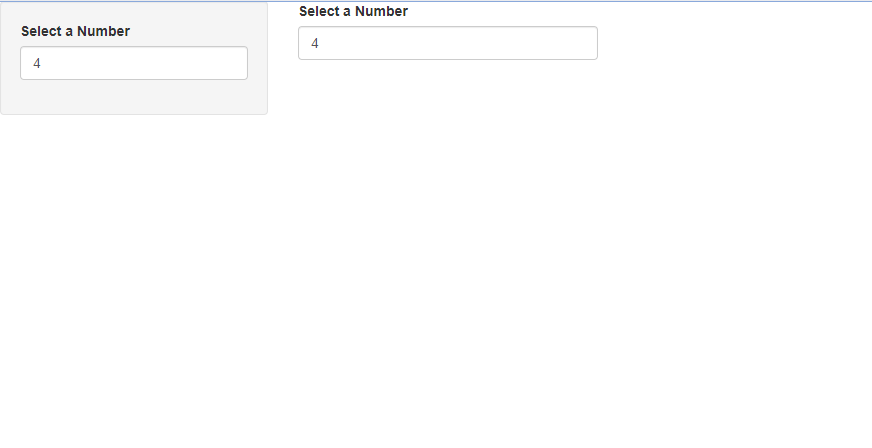
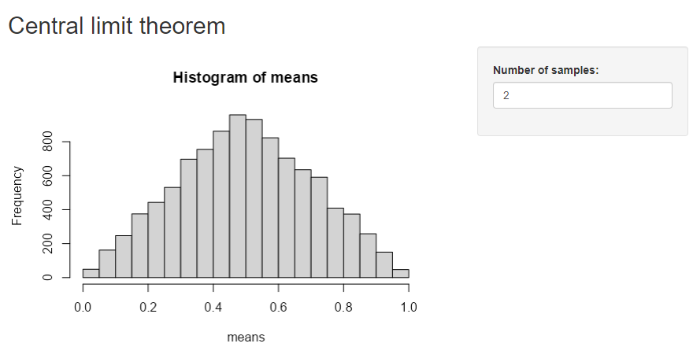
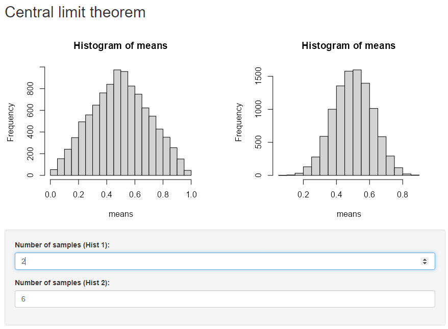
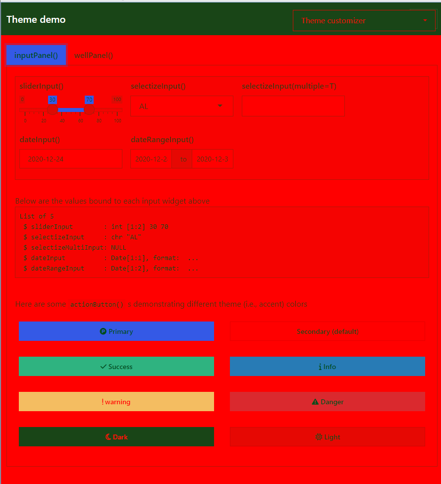

# 6. Layout, themes, HTML

- [Importing libraries](#importing-libraries)
- [Single page layouts](#single-page-layouts)
- [Themes](#themes)

## Importing libraries

``` r
library(shiny)
```

## Single page layouts

1.  Read the documentation of `sidebarLayout()` to determine the width
    (in columns) of the sidebar and the main panel. Can you recreate its
    appearance using `fluidRow()` and column()? What are you missing?

To answer this question let’s create a simple example.

``` r
ui <- fluidPage(
  sidebarLayout(
    sidebarPanel(numericInput("value1","Select a Number", 4)),
    mainPanel(numericInput("value1","Select a Number", 4))
  )
)

shinyApp(ui, function(input, output, session){})
```



To replicate that result we need to wrap the `wellPanel` function in the
first column element as you can see below.

``` r
ui <- fluidPage(
  fluidRow(
    column(4, 
           wellPanel(
             numericInput("value1","Select a Number", 4)
           )
    ),
    column(8, numericInput("value1","Select a Number", 8))
  )
)

shinyApp(ui, function(input, output, session){})
```

2.  Modify the Central Limit Theorem app to put the sidebar on the right
    instead of the left.

``` r
ui <- fluidPage(
  titlePanel("Central limit theorem"),
  sidebarLayout(position = "right",
    sidebarPanel(
      numericInput("m", "Number of samples:", 2, min = 1, max = 100)
    ),
    mainPanel(
      plotOutput("hist")
    )
  )
)
server <- function(input, output, session) {
  output$hist <- renderPlot({
    means <- replicate(1e4, mean(runif(input$m)))
    hist(means, breaks = 20)
  }, res = 96)
}

shinyApp(ui, server)
```



3.  Create an app with that contains two plots, each of which takes up
    half of the width. Put the controls in a full width container below
    the plots.

``` r
ui <- fluidPage(
  titlePanel("Central limit theorem"),
  fluidRow(
    column(6, plotOutput("hist1")),
    column(6, plotOutput("hist2"))
  ),
  fluidRow(
    column(12, 
           wellPanel(
             numericInput("m1", "Number of samples (Hist 1):", 2, min = 1, max = 100),
             numericInput("m2", "Number of samples (Hist 2):", 2, min = 1, max = 100) 
           )
    )
  )
)

server <- function(input, output, session) {
  output$hist1 <- renderPlot({
    means <- replicate(1e4, mean(runif(input$m1)))
    hist(means, breaks = 20)
  }, res = 96)
  
  output$hist2 <- renderPlot({
    means <- replicate(1e4, mean(runif(input$m2)))
    hist(means, breaks = 20)
  }, res = 96)
}

shinyApp(ui, server)
```



## Themes

1.  Use `bslib::bs_theme_preview()` to make the ugliest theme you can.

``` r
bslib::bs_theme(bootswatch = "zephyr") |>
  bslib::bs_theme_update(
    bg = "rgb(255, 0, 0)", 
    fg = "rgb(0, 77, 26)", 
    font_scale = NULL, 
    `enable-shadows` = FALSE, 
    `enable-rounded` = FALSE
  ) |>
  bslib::bs_theme_preview()
```


