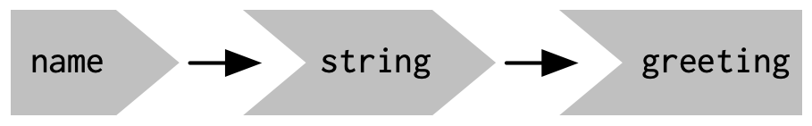
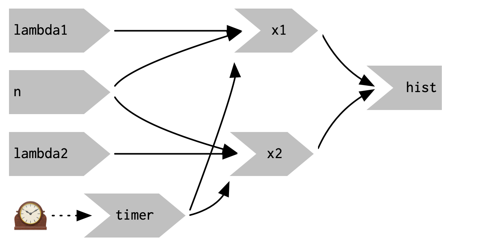

Book Summary
================

- <a href="#introduction-to-shiny" id="toc-introduction-to-shiny">1.
  Introduction to Shiny</a>
  - <a href="#basic-elements" id="toc-basic-elements">1.1. Basic
    Elements</a>
  - <a href="#reactive-expressions" id="toc-reactive-expressions">1.2.
    Reactive expressions</a>
- <a href="#basic-ui" id="toc-basic-ui">2. Basic UI</a>
- <a href="#basic-reactivity" id="toc-basic-reactivity">3. Basic
  reactivity</a>
  - <a href="#the-server-function-arguments"
    id="toc-the-server-function-arguments">The server function arguments</a>
  - <a href="#reactive-programming" id="toc-reactive-programming">Reactive
    programming</a>
  - <a href="#reactive-graph" id="toc-reactive-graph">Reactive graph</a>
  - <a href="#controlling-evaluation"
    id="toc-controlling-evaluation">Controlling evaluation</a>

## 1. Introduction to Shiny

### 1.1. Basic Elements

To create a Shiny app you need follow the next steps:

- Define the **UI** with the `shiny::fluidPage` as the **layout
  function**, where we can add *input* and *output* controls which
  create plain **html**.
- Define server function with the arguments:
  - `input`: To get the user results
  - `outcome`: To assign **ID** to rendered results.
  - `session`
- Run all together in the `shiny::ShinyApp` function.

> **While shiny is running R is busy** and we can’t run new commands at
> the R console until the Shiny app stops.

Here is an simple example

``` r
library(shiny)

# Setting up the basic visual structure (layout function)
# functions under this part only add html code
ui <- fluidPage(

  # Adding a Select Box (input control)
  selectInput(
    # Name for variable selected by the user
    "dataset",

    # Element title
    label = "Dataset",

    # List to display
    choices = ls("package:datasets")
  ),

  # Adding output controls to define where to put
  # the RENDERED output based on server output IDs
  # (output controls)
  verbatimTextOutput("TableSummary"), # displays code
  tableOutput("TableHead")           # displays tables

)


# Defining a function as server
server <- function(input, output, session) {

  # Assigning an ID for this output
  output$TableSummary <- renderPrint({

    # Making sure we are receiving the data
    # from the datasets package rather than
    # any other variable the global environment
    get(input$dataset, "package:datasets") |>
      # Rendering the printed value we want to report
      summary()

  })

  # Assigning an ID for this output
  output$TableHead <- renderTable({

    # Rendering the table we want to report
    get(input$dataset, "package:datasets") |>
      head()

  })
}

# Start the app
shinyApp(ui, server)
```

### 1.2. Reactive expressions

The code `get(input$dataset, "package:datasets")` is duplicated and to
solve that problem we need to create a **reactive expression** as they
**only runs one time** until they **need** to be updated.

To create reactive expressions you just need to:

1.  Wrap your code in a `reactive({})` function.
2.  Save the result in a object
3.  Call the object as an **empty function**.

As you can see in the next example:

``` r
server <- function(input, output, session) {
  # Create a reactive expression
  dataset <- reactive({
    get(input$dataset, "package:datasets")
  })

  output$summary <- renderPrint({
    # Use a reactive expression by calling it like a function
    summary(dataset())
  })
  
  output$table <- renderTable({
    dataset()
  })
}
```

## 2. Basic UI


## 3. Basic reactivity

Every **shiny** runs based on the next objects. - `ui`: Contains the
HTML presented to every user of your app. - `server`: Shiny invokes your
`server()` function each time a new session starts, to show an
independent version of the app for each user.

### The server function arguments

- `input`: It is a *list-like* and *only-read* object that contains all
  the input data sent *from the browser*, available by the syntax
  `input$ID`.

- `Output`: It is a *list-like object* (`output$ID`) assigned to the
  output of `render` functions which map inputs and outputs after
  converting the `R` into *HTML*.

### Reactive programming

When we write an `R` script we use ***imperative programming*** as
commands are carried out immediately, but `shiny` uses ***declarative
programming*** so we just need to define higher-level goals or describe
important constraints and `shiny` will decide how and/or when to
translate that into action, as result Shine app can be:

- Extremely *lazy* and only updates the output controls that you can
  currently see.
- Hard to understand reading from top to bottom, as the code runs solely
  determined by the *reactive graph*.

### Reactive graph

They are useful to understand how the *inputs and outputs are
connected*.

**Reactive expressions** reduces duplication in your reactive code by
introducing additional nodes into the reactive graph.

``` r
server <- function(input, output, session) {
  output$greeting <- renderText(string())
  string <- reactive(paste0("Hello ", input$name, "!"))
}
```



As reactive expressions can use the results of a reactive expression in
an output (like *inputs*) and depend on inputs (like *outputs*), they
fit well as **producers** and **consumers**.


### Controlling evaluation

1.  If we want to update any element every `x` milliseconds we can use
    `reactiveTimer()`.

``` r
server <- function(input, output, session) {
  timer <- reactiveTimer(500)
  
  x1 <- reactive({
    timer()
    rpois(input$n, input$lambda1)
  })
  x2 <- reactive({
    timer()
    rpois(input$n, input$lambda2)
  })
  
  output$hist <- renderPlot({
    freqpoly(x1(), x2(), binwidth = 1, xlim = c(0, 40))
  }, res = 96)
}
```



2.  If you have a long process you might want to require the user to
    opt-in to performing the expensive calculation by requiring them to
    click a button `actionButton()` and then call the `eventReactive()`
    to update the app.

``` r
ui <- fluidPage(
  fluidRow(
    column(3, 
      numericInput("lambda1", label = "lambda1", value = 3),
      numericInput("lambda2", label = "lambda2", value = 5),
      numericInput("n", label = "n", value = 1e4, min = 0),
      actionButton("simulate", "Simulate!")
    ),
    column(9, plotOutput("hist"))
  )
)

server <- function(input, output, session) {
  x1 <- eventReactive(input$simulate, {
    rpois(input$n, input$lambda1)
  })
  x2 <- eventReactive(input$simulate, {
    rpois(input$n, input$lambda2)
  })

  output$hist <- renderPlot({
    freqpoly(x1(), x2(), binwidth = 1, xlim = c(0, 40))
  }, res = 96)
}
```


3.  If you need to reach outside of the app and cause side-effects to
    happen else where in the world you could find `observeEvent()`
    useful to debug, as it runs its argument `handlerExpr` every time
    the `eventExpr` argument is updated.

``` r
ui <- fluidPage(
  textInput("name", "What's your name?"),
  textOutput("greeting")
)

server <- function(input, output, session) {
  string <- reactive(paste0("Hello ", input$name, "!"))
  
  output$greeting <- renderText(string())
  observeEvent(input$name, {
    message("Greeting performed")
  })
}
```


