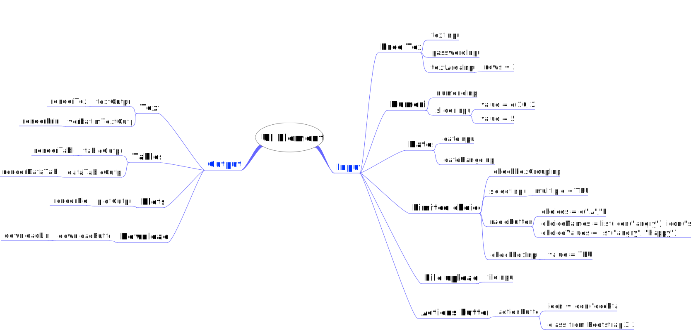

Book Summary
================

- <a href="#introduction-to-shiny" id="toc-introduction-to-shiny">1.
  Introduction to Shiny</a>
  - <a href="#basic-elements" id="toc-basic-elements">1.1. Basic
    Elements</a>
  - <a href="#reactive-expressions" id="toc-reactive-expressions">1.2.
    Reactive expressions</a>
- <a href="#basic-ui" id="toc-basic-ui">2. Basic UI</a>
- <a href="#basic-reactivity" id="toc-basic-reactivity">3. Basic
  reactivity</a>

## 1. Introduction to Shiny

### 1.1. Basic Elements

To create a Shiny app you need follow the next steps:

- Define the **UI** with the `shiny::fluidPage` as the **layout
  function**, where we can add *input* and *output* controls which
  create plain **html**.
- Define server function with the arguments:
  - `input`: To get the user results
  - `outcome`: To assign **ID** to rendered results.
  - `session`
- Run all together in the `shiny::ShinyApp` function.

> **While shiny is running R is busy** and we can’t run new commands at
> the R console until the Shiny app stops.

Here is an simple example

``` r
library(shiny)

# Setting up the basic visual structure (layout function)
# functions under this part only add html code
ui <- fluidPage(

  # Adding a Select Box (input control)
  selectInput(
    # Name for variable selected by the user
    "dataset",

    # Element title
    label = "Dataset",

    # List to display
    choices = ls("package:datasets")
  ),

  # Adding output controls to define where to put
  # the RENDERED output based on server output IDs
  # (output controls)
  verbatimTextOutput("TableSummary"), # displays code
  tableOutput("TableHead")           # displays tables

)


# Defining a function as server
server <- function(input, output, session) {

  # Assigning an ID for this output
  output$TableSummary <- renderPrint({

    # Making sure we are receiving the data
    # from the datasets package rather than
    # any other variable the global environment
    get(input$dataset, "package:datasets") |>
      # Rendering the printed value we want to report
      summary()

  })

  # Assigning an ID for this output
  output$TableHead <- renderTable({

    # Rendering the table we want to report
    get(input$dataset, "package:datasets") |>
      head()

  })
}

# Start the app
shinyApp(ui, server)
```

### 1.2. Reactive expressions

The code `get(input$dataset, "package:datasets")` is duplicated and to
solve that problem we need to create a **reactive expression** as they
**only runs one time** until they **need** to be updated.

To create reactive expressions you just need to:

1.  Wrap your code in a `reactive({})` function.
2.  Save the result in a object
3.  Call the object as an **empty function**.

As you can see in the next example:

``` r
server <- function(input, output, session) {
  # Create a reactive expression
  dataset <- reactive({
    get(input$dataset, "package:datasets")
  })

  output$summary <- renderPrint({
    # Use a reactive expression by calling it like a function
    summary(dataset())
  })
  
  output$table <- renderTable({
    dataset()
  })
}
```

## 2. Basic UI



## 3. Basic reactivity
